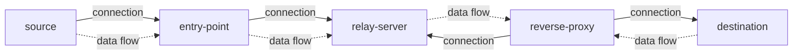

# tcp-reverse-proxy

A TCP TURN service with authentication, consists of three components: `entry-point`, `relay-server`, and `reverse-proxy`.

- `entry-point` is the main entry of the system. It listens on multiple ports and forwards all incoming data to the `relay-server`.

- The `relay-server` is responsible for forwarding the data received from the `entry-point` to the `reverse-proxy`.

- The `reverse-proxy` actively establishes a TCP connection to the `relay-server` to receive incoming requests from the source, and then forwards the data to the appropriate destination (dst) based on routing configuration.



## Build

- Cross-compile for all platforms

  ```sh
  make build
  ```

  Binary executables will be generated under the `build/os/arch` directory

- Build for the commonly used `linux/amd64` platform

  ```sh
  make build-linux-amd64
  ```

## Usage

1. Generate x509 cert and ed25519 key pair

   ```sh
   gen-cert x509 --dns localhost --ip 127.0.0.1,$YOUR_PUBLIC_IP
   gen-cert ed25519
   ```

   This step will generate x509 and ed25519 key pairs under the cert directory. The x509 key pair is used for establishing TLS connections, while the ed25519 key pair is used for authentication.

2. Start the `relay-server` on a server with public network access

   ```sh
   relay-server -p 4433
   ```

   The `relay-server` will automatically load certificates from the cert directory, listen on a local port, and wait for incoming connections from both the `entry-point` and the `reverse-proxy`.

3. Start the `reverse-proxy` on a server without public network access but that needs to be accessible from the outside

   ```sh
   reverse-proxy -s $YOUR_PUBLIC_IP:4433
   ```

   Tell the `reverse-proxy` the address of the `relay-server`. It will actively open pending connections to get ready for incoming user requests.

4. Start the `entry-point` (usually on your local machine)

   ```sh
   entry-point -s $YOUR_PUBLIC_IP:4433 -r 5001:5001
   ```

   Tell the `entry-point` the address of the `relay-server`. It will actively open pending connections for transmitting user requests. The `-r`(or `--routes`) parameter specifies the routing configuration. Multiple routing configurations are separated by commas. Supported formats are as follows:

   | Format          | Description                                                                                                                                    |
   | :-------------- | :--------------------------------------------------------------------------------------------------------------------------------------------- |
   | port:port       | Listen on a specified local port, accept connections from anywhere, and forward them to a specified port on remote `127.0.0.1`                 |
   | ip:port:port    | Listen on a specified local port, accept connections only from a specified IP, and forward them to a specified port on remote `127.0.0.1`      |
   | port:ip:port    | Listen on a specified local port, accept connections from any source, and forward them to a specified IP and port on the remote side           |
   | ip:port:ip:port | Listen on a specified local port, accept connections only from a specified IP, and forward them to a specified IP and port on the remote side. |

5. Send a request to the `entry-point`
