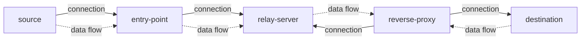

# tcp-reverse-proxy

A TCP TURN service with authentication, consists of three components: `entry-point`, `relay-server`, and `reverse-proxy`.

- `entry-point` is the main entry of the system. It listens on multiple ports and forwards all incoming data to the `relay-server`.

- The `relay-server` is responsible for forwarding the data received from the `entry-point` to the `reverse-proxy`.

- The `reverse-proxy` actively establishes a TCP connection to the `relay-server` to receive incoming requests from the source, and then forwards the data to the appropriate destination (dst) based on routing configuration.

